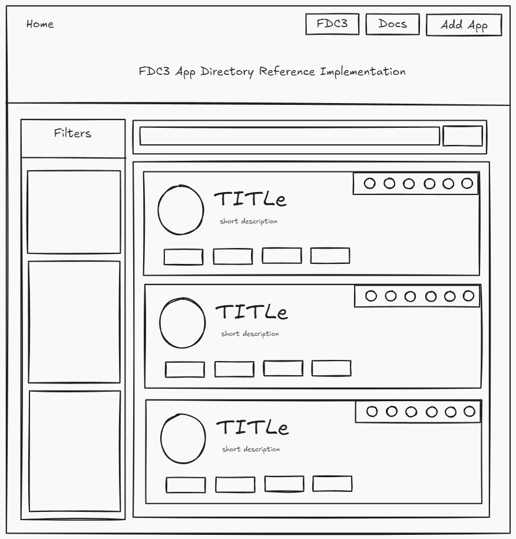

# AppD Reference Implementation

AppD reference implementation in Nodejs for organizations to:

1. directly, saving a firm from implementing their own AppD
2. as a starting point by firm implementing their own AppD
3. as an example of expected behavior from AppD.

## Features

- Supports Finos AppD reference standard
- `/intents` url to get the intents of an app
- Static configuration to get appD records hosted anywhere
- Extracts domain name from a fully qualified namespace `appId@fqdn` to get record of appId from fqdn
- Global Error Handler
- JWT authorization + RBAC support for specified apps
- UI Catalog to view the list of apps available in the hosted AppD
- Swagger Documentation
- Redirect `/appd/apps/...` to the latest version of appD ie `/appd/v2/apps/`

## Tech stack

- [Express](https://expressjs.com/)
- [NextJS](https://www.nextjs.org)
- [TS](https://www.typescriptlang.org/)

## Setup

### Server

```bash
git clone https://github.com/Ts-A/AppD-Reference
cd AppD-Reference
cp sample.env .env
# Setup env variables
npm install
npm run start
```

### UI Catalog

```bash
cd AppD-Reference/ui
npm install
npm run dev
```

### Plugins

This part is for setting up jwt authentication, static configuration of instances.

> In /appD.config.json

```json
{
  "instances": {
    "appd1.foo.com": "http://localhost:3002" // to add instances of hosted appDs
  },
  "appd_record_protection": [
    {
      "appId": "adaptabledemo",
      "roles": ["user", "admin"],
      "secret": "secret"
    }
  ] // to add authorization for specific apps
}
```

## Useful resources

[Problem Statement](https://github.com/finos/community/discussions/331)
[What is AppD?](https://fdc3.finos.org/docs/app-directory/overview)

### UI Mockup


